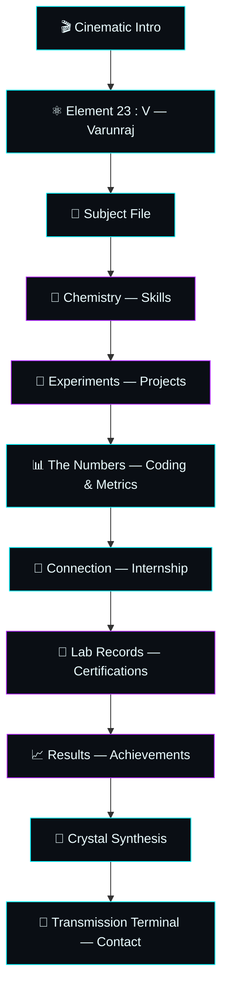
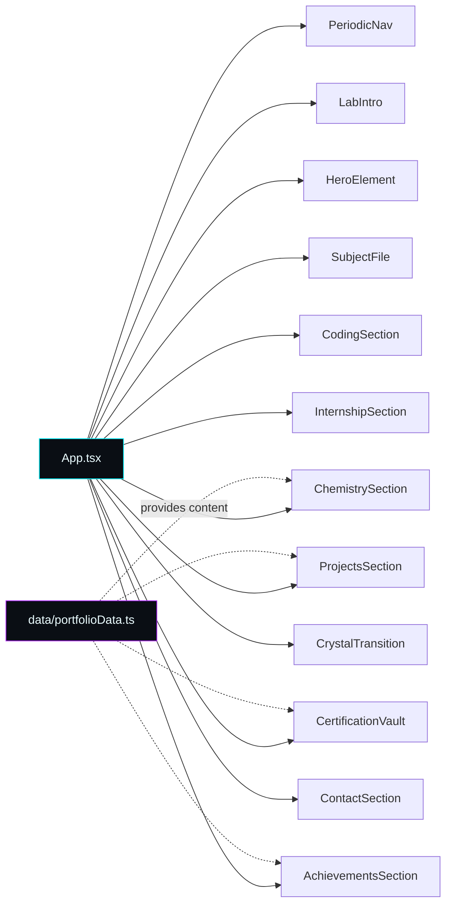

<div align="center">


<br/>

[](https://varunraj-portfolio-tau.vercel.app/)
[](https://github.com/varunraj-2005/Varunraj-Portfolio/stargazers)
[](#-license)

<br/>


</div>


## 📖 Table of Contents

<div align="center">

| [🧪 The Concept](#-the-concept) | [🎬 Experience Flow](#-experience-flow) | [✨ What Makes It Different](#-what-makes-it-different) | [🧬 Elements — Tech Stack](#-elements--tech-stack) |
|:---:|:---:|:---:|:---:|
| **[🧪 Experiments — Projects](#-experiments--projects)** | **[📊 The Numbers](#-the-numbers)** | **[🗂️ Project Architecture](#️-project-architecture)** | **[🎨 Design Philosophy](#-design-philosophy)** |
| **[🧠 Engineering Principles](#-engineering-principles)** | **[🚀 Running Locally](#-running-locally)** | **[🧩 Future Experiments](#-future-experiments)** | **[📡 Connect](#-connect)** |

</div>


## 🧪 The Concept

> **Code is the element. Curiosity is the catalyst. Every project is an experiment.**

**The Periodic Table of Varunraj** is an experimental, cinematic developer portfolio where software engineering meets the visual language of a scientific laboratory. Instead of a conventional `Hero → About → Skills → Projects → Contact` layout, this experience treats **skills as elements, projects as experiments, achievements as measurements, certifications as laboratory records**, and the developer profile itself as a **subject file**.

| Portfolio Concept | Laboratory Interpretation |
|---|---|
| Developer | 🧬 Research Subject |
| Skills | ⚛️ Chemical Elements |
| Projects | 🧪 Experiments |
| Coding Practice | 📊 Measurements |
| Internship | 🔬 Connection |
| Certifications | 📁 Laboratory Records |
| Achievements | 📈 Results |
| Contact | 📡 Transmission Terminal |
| Navigation | ⚗️ Periodic Table |
| Final Section | 💎 Crystal Synthesis |

The goal isn't just to *show* information — it's to make the visitor **experience the portfolio**.

<br/>

## 🎬 Experience Flow

The site opens with a cinematic laboratory intro and progressively reveals the portfolio through animated, scroll-driven transitions.



<br/>

## ✨ What Makes It Different

<table>
<tr>
<td width="50%" valign="top">

### ⚛️ Periodic Table Navigation
Navigation is inspired by a scientific periodic table — each section gets its own symbolic element (`V`, `Ab`, `Ch`, `Pr`, `Le`, `In`, `Ce`, `Au`, `Co`). Navigation becomes part of the portfolio's identity, not just a menu.

### 🎞️ Cinematic Opening Sequence
A dedicated laboratory intro plays before the portfolio reveals itself — animated intro, smooth transitions, atmospheric particles, film-grain texture, and session-aware playback so returning visitors aren't forced to rewatch it.

</td>
<td width="50%" valign="top">

### 🌌 Ambient Particle Environment
An atmospheric background layer continuously adds depth behind the content, so the site feels like an interactive digital laboratory rather than a static page.

### 🧬 Skills as Chemical Elements
Each technology is presented as an experimental element — complete with an element number, symbol, category, proficiency, applications, and "atomic mass" — instead of a plain "I know Java" bullet point.

</td>
</tr>
</table>

<br/>

## 🧬 Elements — Tech Stack

<div align="center">

</div>

<sub>Each tile continuously cycles its glow between cyan and violet — a small nod to elements shifting energy states.</sub>

**Frontend:** React · TypeScript · Vite · Tailwind CSS · Motion · Lucide React
**Animation & Interaction:** Motion-based transitions · Scroll-driven section changes · Cinematic intro · Particle background · Film grain · Crystal transitions · ScrollSpy navigation

<br/>

## 🧪 Experiments — Projects

### Featured Experiment: Adaptive Multilingual Aspect-Based Sentiment Framework

An intelligent sentiment-analysis system built to analyze application reviews using multilingual NLP and aspect-based sentiment analysis.

<div align="center">


</div>

<br/>

## 📊 The Numbers

<div align="center">

| 🧪 Measurement | Value |
|:---:|:---:|
| Problems Solved | **500+** |
| HackerRank Java Badge | **5★** |
| CGPA | **8.2** |

</div>

These are presented as experimental observations rather than ordinary stats — each number is a recorded measurement from the lab.

<br/>

## 🗂️ Project Architecture

```
src/
│
├── components/
│   ├── AchievementsSection.tsx
│   ├── CertificationVault.tsx
│   ├── ChemistrySection.tsx
│   ├── CodingSection.tsx
│   ├── ContactSection.tsx
│   ├── CrystalTransition.tsx
│   ├── EventExperiment.tsx
│   ├── FilmGrain.tsx
│   ├── FinalProduct.tsx
│   ├── Footer.tsx
│   ├── HeroElement.tsx
│   ├── InternshipSection.tsx
│   ├── LabIntro.tsx
│   ├── ParticleBackground.tsx
│   ├── PeriodicNav.tsx
│   ├── ProjectsSection.tsx
│   ├── SectionLabel.tsx
│   ├── SentimentExperiment.tsx
│   ├── SkillElement.tsx
│   └── SubjectFile.tsx
│
├── data/
│   └── portfolioData.ts
│
├── App.tsx
├── main.tsx
├── index.css
└── types.ts
```



Each laboratory section is an isolated component, keeping the portfolio easy to maintain and extend.

<br/>

## 🎨 Design Philosophy

The visual system intentionally avoids the typical *"gradient background + glass cards + generic developer illustration"* approach. Instead it leans into a darker scientific aesthetic:

- Laboratory-inspired typography & technical labels
- Element symbols & measurement interfaces
- Scientific terminology, atmospheric particles, grain and texture
- Controlled motion & experimental transitions
- Sequential, story-driven scroll narrative

The interface is designed to feel like a **classified research facility from the future**.

<br/>

## 🧠 Engineering Principles

| # | Principle | What it means |
|:--:|---|---|
| 01 | **Identity over Templates** | The portfolio should be recognisable even without seeing the developer's name |
| 02 | **Motion with Purpose** | Animation communicates transitions, hierarchy, and discovery — never just decoration |
| 03 | **Storytelling** | Every section contributes to one larger narrative |
| 04 | **Componentisation** | Every major experience is isolated into a reusable React component |
| 05 | **Data-driven Content** | Portfolio content is separated from presentation wherever practical |
| 06 | **Progressive Discovery** | Information reveals itself as the visitor scrolls, not all at once |

<br/>

## 🚀 Running Locally

New to Git? Just copy each command below into your terminal, one at a time.

### ✅ Prerequisites

| Requirement | Notes |
|---|---|
| Node.js | Any recent LTS version |
| npm | Comes bundled with Node.js |

### 1️⃣ Clone & enter the project

```bash
git clone https://github.com/varunraj-2005/Varunraj-Portfolio.git
cd Varunraj-Portfolio
```

### 2️⃣ Install dependencies

```bash
npm install
```

### 3️⃣ Start the dev server

```bash
npm run dev
```

The app will be available through the local Vite development server (usually `http://localhost:5173`).

### 🏗️ Production Build

```bash
npm run build      # Optimised production build
npm run preview    # Preview the production build locally
npm run lint        # TypeScript validation
```

<br/>

## ⚡ Performance & Interaction

- Component-based rendering with lazy visual calculations
- Passive scroll listeners & controlled animation states
- Smooth, ScrollSpy-driven section navigation
- Session-aware intro playback (returning visitors skip the cinematic replay)
- Data-driven, responsive rendering throughout

<br/>

## 🧩 Future Experiments

The laboratory is intentionally designed to keep evolving:

- 🧠 Interactive AI assistant
- 🧪 Live project demonstrations
- 🛰️ Real-time GitHub activity feed
- 📡 Contact transmission animation
- 🌐 Multilingual portfolio mode
- 🧬 More advanced scroll-linked animations
- 🎮 Interactive coding experiments
- 🧊 Advanced WebGL crystal effects
- 🔭 Full 3D laboratory environment

<br/>

## 👨‍💻 About the Developer

**P. Varunraj** — B.Tech Information Technology student and software developer interested in building intelligent, interactive, and practical applications.

```
Software Engineering → Full Stack Development → Artificial Intelligence
    → Natural Language Processing → Problem Solving → Creative Web Experiences
```

<br/>

## 📡 Connect

<div align="center">

[](https://varunraj-portfolio-tau.vercel.app/)
[](https://github.com/varunraj-2005)
[](https://www.linkedin.com/in/varunraj-p-5b8813313)
[](mailto:rajapandian1412@gmail.com)

</div>

<br/>

## 🧪 Final Observation

This portfolio isn't another `About → Skills → Projects → Contact` collection. It's an **interactive experiment** — every animation introduces a new state, every section reveals another part of the subject, every project becomes an experiment, every skill becomes an element, every achievement becomes a measurement.

**And the visitor becomes the observer.**

<br/>

## 📜 License

This project is a personal portfolio experience. Feel free to take inspiration from the architecture and interaction concepts — please don't directly reproduce the branding, identity, content, or visual design as your own.

<div align="center">

### ⚛️ BUILD → EXPERIMENT → LEARN → REACT → EVOLVE


</div>
